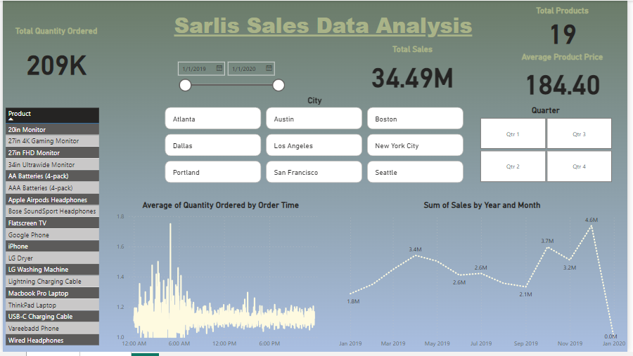

# **SARLIS-SALES-ANALYSIS**

## **Introduction**

In this project we dive into a large sales dataset of “SARLIS” to extract valuable insights to answer crucial questions and help make data driven decisions.

We will explore and analyze sales data to identify trends, top-selling products, and revenue metrics for business decision-making and create visualizations to present findings effectively. 

This project showcases my ability to manipulate and derive insights from large datasets, enabling me to make data-driven recommendations for optimizing sales strategies.

The dataset is designed with an assumption that the orders are placed by customers living in the United States of America.

## **Problem Statement/Business Questions**

1.	How have the sales trends changed over time? Which months, quarters, or years had the highest and lowest sales? What factors might explain these fluctuations?
2.	Which products are the best-selling in terms of quantity and revenue? 
3.	What are the revenue metrics for each product, such as total sales, average sales price, cost of goods sold, and profit margin? How do these metrics vary across different regions or markets?
4.	How can the sales strategies be optimized to increase revenue and profitability? What are the recommendations for pricing, promotion, distribution, and customer retention?

## **Skills/ concepts Demonstrated.**

The following skills were demonstrated, Data cleaning, Quick measures, Data Visualization, exploratory data analysis using Ms Excel and Power BI Tools.

### **Data Cleaning.**

The dataset was cleaned using Microsoft Excell 356 and when came in as CSV format and had to be changed into Excel Workbook format so that it can be saved and worked on properly. The dataset contains 185951 rows and 11 columns.

The had to split the order date collum so that I obtain separate columns for Order Date and Order Time using this formula (=INT(F2)) to obtain date into collum G2 as well as (=F2-G2) to obtain the time in collum H2 and then I applied Auto fill for the rest of the remaining 185951 rows. 

For accurate analysis, the decimal points weren’t changed to whole numbers.

### **Data Visualization**

Upon cleaning the data was loaded into Power BI and 2 pages were created

### **Home Page**

The home page is summarizing all the information needed to be know about the SARLIS STORES, where they operate and what do they operate it.

### **Sales Analysis**

You can interact with the report via this Link

https://app.powerbi.com/groups/me/reports/f32289d5-4c37-4537-af7d-f584ea00cc1f/ReportSection?experience=power-bi

## **Conclusions and Recommendations**

At some extent time affects the number of customers coming into the stores and its observed between 2:30am and 6:30am the rate of incoming customers increases hence the store managers should ensure that the staff are always on high alert to attend to them and they get better services which can in one way or another increase the sales of the stores 

Its observed also customers prefer cash to any other payment method when shopping maybe because its easier and takes time than the process of using other payment methods, store managers should ensure that more information is given to customers about use of other methods as well as increasing card machines to smoothen the process of payments as this ensures that no losses happen to the store incase fake money is brought to the store.

